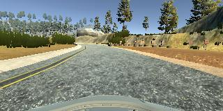
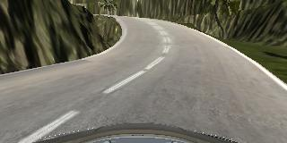

# Behavioral Cloning Project
- Prabath Peiris
- peiris.prabath@gmail.com
- Udacity (Self Driving Car (CarND) - Term 1)


## The goals / steps of this project are the following:
* Use the simulator to collect data of good driving behavior
* Build, a convolution neural network in Keras that predicts steering angles from images
* Train and validate the model with a training and validation set
* Test that the model successfully drives around track one without leaving the road
* Summarize the results with a written report


## Rubric Points
 Here I will consider the [rubric points](https://review.udacity.com/#!/rubrics/432/view) individually and describe how I addressed each point in my implementation.


### Files Submitted & Code Quality

#### 1. My project includes the following files:


* **model.py** - this file contain the code that read data from files, preprocessing
data, deep learning network and training steps.
* **drive.py** - Connects to Udacity simulator (not provided) to feed image data from the simulator to my model, and angle data from my model back to the simulator
* **model.h5** - A saved Keras model, trained using model.py, capable of reliably steering the car all the way around Track 1
* **video.mp4** - Video of the car driving around the track, with steering data supplied by model.h5


#### 2. Functional code to run the simulator with the model.h5 file
Using the Udacity provided simulator and my drive.py file, the car can be driven autonomously around the track by executing
```sh
python drive.py model.h5
```


#### 3. Submission code is usable and readable

**model.py** file contains the code that generate the *model.h5* file including the convolution neural network.  the **main()** function show the pipleline I have used to train the and validate the model. I have include the appropriate comments for each sections.

#### 4. Appropriate training data

I have generated training data using the simulator. Training data has been generated using many scenarios such as:

- Driving on track 1 and keep the vehicle center of the road
- Driving on track 1 counter clock direction while keeping the vehicle center of the road
- Driving on the track 1 forcusing on sharp corners
- Driving on the track 1 counter clock direction while forcusing on sharp corners
- Driving on the track 1 by recovering the car from outsde the road
- Driving on the track 1 by moving away from the side lanes
- Driving on the track 1 more towards left and right sides
- Driving on the track 2 clock and counter clock directions


### Model Architecture and Training Strategy

#### 1. Solution Design Approach


I have started with the Keras implementation of the Nvidia convolutional neural network explicitly designed to generate steering data for self-driving cars based on camera inputs. I thought this model might be appropriate to start with because it has mentioned in the lectures. To gauge how well the model was working, I split my image and steering angle data into a training and validation set using `train_test_split` method in `sklearn` package. I started with less amount of data that did not have many variations that failed the vehicle to go over the boundaries of the road and this point I have seen the MSE for both validation and training data are high. This is an indication of "underfitting" data. When I have periodically increased the amount of data with variations (described above), I have seen the MSE for validation dataset was high and MSE of the training is low, this is an indication of "Overfitting" data. I start using left and right camera images with a small correction to steering angle including the center flip image to tackle the overfitting. I have also included a lot of data from the Track 2 to make data more generalized. Combinations of those attempts brought the MSE values monotonically decreasing for both validation and training data. I used an Adams optimizer, so tuning learning rate was not necessary.


#### 2. Final Model Architecture


The final model architecture (model.py lines 18-24) consisted of a convolution neural network with the following layers and layer sizes

**LAYER 1**
I have used the layer 1 as a Lambda function to normalize the data as follows,
```
model.add(Lambda(lambda x: (x/255.0) - 0.5, input_shape=(160, 320, 3)))
```

**LAYER 2**
Layer 2 crop the images to avoid feeding the sky and mountaind in the horizon. I have realized these extra data that does not need to keep the vehicle on the late confuse the network.

```
model.add(Cropping2D(cropping=((70, 25),(0,0))))
```

**LAYER 3 to LAYER 7**
Add convolution layers from layer 3 to layer 7 with the relu activation function.
```
model.add(Convolution2D(24, 5, 5, subsample=(2, 2), activation="relu"))
model.add(Convolution2D(36, 5, 5, subsample=(2, 2), activation="relu"))
model.add(Convolution2D(48, 5, 5, subsample=(2, 2), activation="relu"))
model.add(Convolution2D(64, 3, 3, activation="relu"))
model.add(Convolution2D(64, 3, 3, activation="relu"))
```
**LAYER 8**
Flattern the image data using Flattern layer
```
model.add(Flatten())
```

**LAYER 9**
Dropout Layer
```
model.add(Dropout(0.5))
```

**LAYER 10**
Dense Layer with ReLu activation
```
model.add(Dense(512, activation="relu"))
```

**LAYER 11**
Dropout Layer
```
model.add(Dropout(0.5))
```

**LAYER 12**
Dense Layer with ReLu activation
```
model.add(Dense(128, activation="relu"))
```

**LAYER 13**
Dropout Layer
```
model.add(Dropout(0.5))
```

**LAYER 14**
Dense Layer with ReLu activation
```
model.add(Dense(32, activation="relu"))
```

**LAYER 15**
```
model.add(Dense(1))
```


#### 3. Creation of the Training Set & Training Process

I had lot of fun capturing training data from the simulator. Initial attempts were not that good as time go by I was able to drive the car smoothly center on the road. First I start with recording data from couple of laps. Here is an example image of center lane driving:


To capture good driving behavior, I first recorded two laps on track one using center lane driving. Here is an example image of center lane driving:



I then recorded the vehicle recovering from the left side and right sides of the road back to center so that the vehicle would learn to avoid the edges of the road. These images show the recovery from both left and right sides


I have also use the track 2 to generate data to avoid overfitting and generalized the model.Some of the images are from track 2 as follows,




I had 34682 todal number of images including the augmented images and train the model for 3 epocs.
